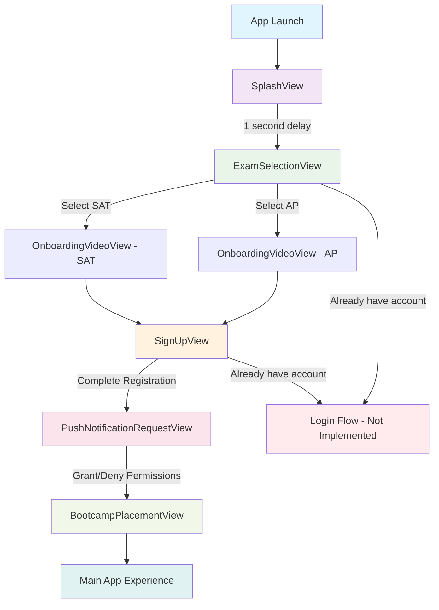

# TeachTap View Flow Documentation

## Overview
This document outlines the view hierarchy and navigation flow in the TeachTap iOS application. The app follows a sequential onboarding flow that guides users from initial app launch through exam selection, onboarding, registration, permissions, and placement testing.

## View Hierarchy Analysis

### Main Container: ContentView
The `ContentView` serves as the primary navigation controller, managing the application's flow through a series of boolean state variables:

- `showSplash`: Controls initial splash screen display
- `selectedExam`: Stores user's exam choice (SAT or AP)
- `showOnboarding`: Triggers onboarding video flow
- `showSignUp`: Displays registration form
- `showPushNotificationRequest`: Shows notification permission request
- `showBootcampPlacement`: Navigates to placement testing

### Navigation Flow Logic
The view selection follows a hierarchical if-else structure with the following priority:

1. **SplashView** (highest priority - shown first)
2. **OnboardingVideoView** (if showOnboarding = true)
3. **BootcampPlacementView** (if showBootcampPlacement = true)
4. **PushNotificationRequestView** (if showPushNotificationRequest = true)
5. **SignUpView** (if showSignUp = true)
6. **ExamSelectionView** (default fallback)

## Detailed View Descriptions

### 1. SplashView
- **Purpose**: Brand introduction and app loading
- **Duration**: 1 second auto-transition
- **Components**: TeachTap logo, tagline, loading indicator
- **Next**: Automatically transitions to ExamSelectionView

### 2. ExamSelectionView
- **Purpose**: Exam type selection (SAT or AP)
- **User Action**: Tap exam button
- **Components**: Two exam selection buttons, login link
- **Next**: OnboardingVideoView (with selected exam type)

### 3. OnboardingVideoView (External)
- **Purpose**: Educational content about selected exam
- **User Action**: Complete onboarding
- **Next**: SignUpView

### 4. SignUpView
- **Purpose**: User registration and account creation
- **Components**: 
  - Form fields: Name, Grade, Email, Password
  - Grade dropdown selection
  - Marketing opt-in checkbox
  - Terms & Privacy links
- **Validation**: Grade selection required
- **Next**: PushNotificationRequestView

### 5. PushNotificationRequestView (External)
- **Purpose**: Request push notification permissions
- **User Action**: Grant/deny permissions
- **Next**: BootcampPlacementView

### 6. BootcampPlacementView (External)
- **Purpose**: Assessment test for user placement
- **Final Destination**: Main app experience

## State Management Patterns

### Navigation State Variables
```swift
@State private var showSplash = true           // Initial state
@State private var selectedExam: ExamType? = nil
@State private var showOnboarding = false
@State private var showSignUp = false
@State private var showPushNotificationRequest = false
@State private var showBootcampPlacement = false
```

### Data Models
- **ExamType**: Enum with cases `.sat` and `.ap`
- **Grade**: Enum with 5 academic levels (9th-12th grade + post-grad)

## User Experience Flow



## Key Features & Patterns

### 1. Animation Transitions
- Smooth transitions using `withAnimation(.easeInOut(duration: 0.5))`
- Applied to major navigation changes

### 2. Validation Logic
- Grade selection validation in SignUpView
- Error state management with visual feedback

### 3. Custom Components
- `CustomTextFieldStyle`: Consistent styling for form inputs
- Custom logo design in SplashView

### 4. Responsive Design
- ScrollView container for SignUpView to handle keyboard
- Proper spacing and padding throughout

## External Dependencies
The following views are referenced but defined in separate files:
- `OnboardingVideoView`
- `PushNotificationRequestView`
- `BootcampPlacementView`

## Debug Features
- Console logging for user interactions
- Debug comments for tracking navigation events

## Next Steps
1. Login functionality implementation
2. Backend integration for user registration
3. Navigation back functionality from sign-up flow
4. Error handling for network operations 